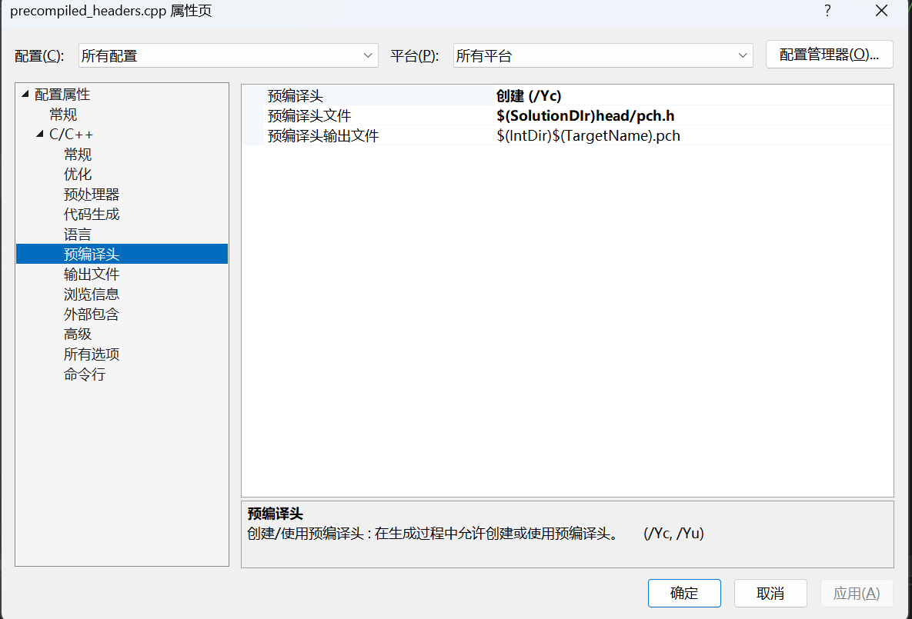
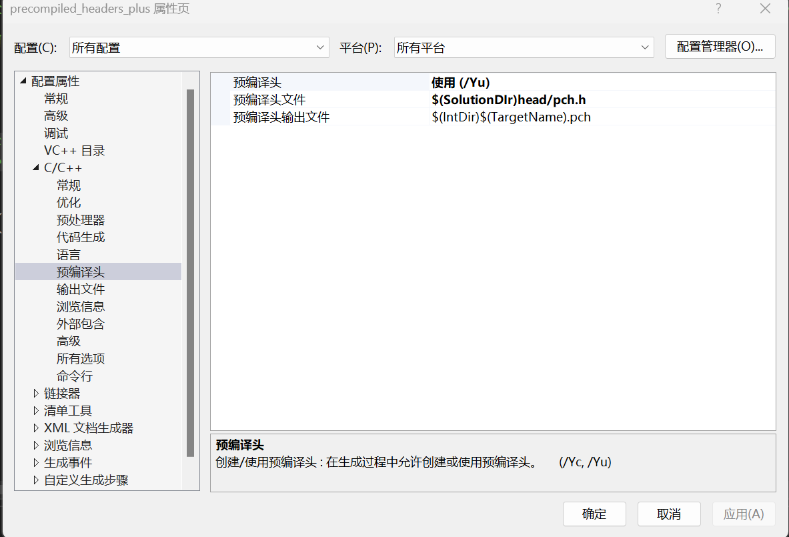
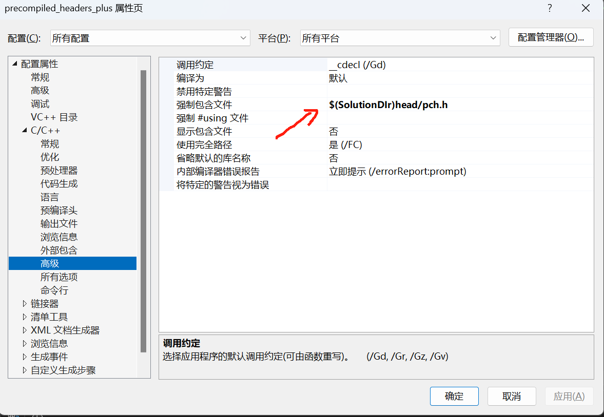
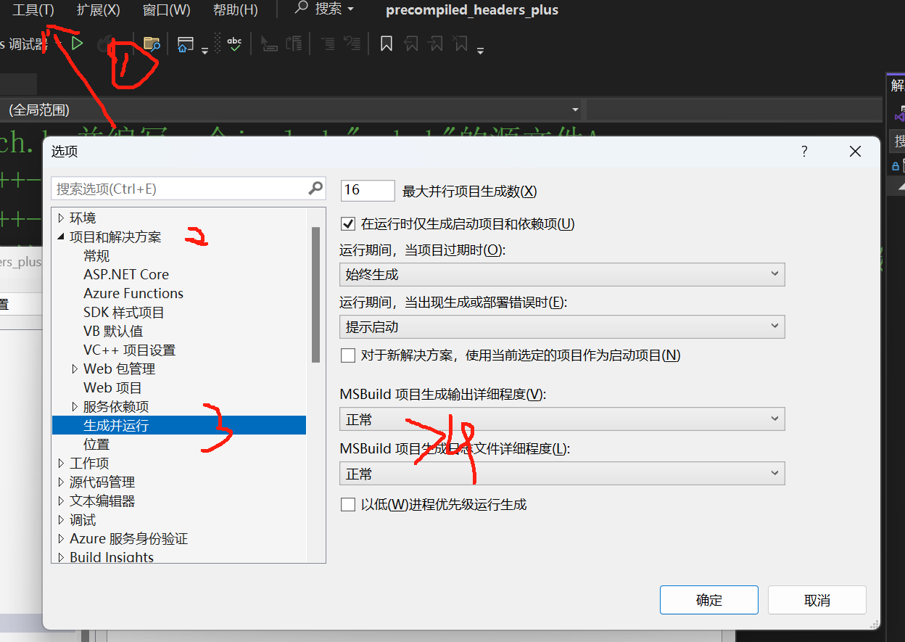

# precompiled_headers_plus
### 步骤
- 将常用大型头文件写入pch.h,并编写一个include"pch.h"的源文件(如本例的precompiled_headers,cpp)

- 将该源文件的属性->c/c++->预编译头->设置为创建，下面改成 对应目录和名字 (如本例的$(SolutionDir)head\pch.h

- 将整个项目的属性->c/c++->预编译头->设置为使用，下面改为 同上

- 预编译头需要每个源文件的第一行都是include"pch.h"，可以在项目属性->c/c++->高级->强制包含中写入 该头文件名 (如本例为$(SolutionDir)head\pch.h

- tips:工具->选项->项目和生成->可以设置在输出中显示用时

